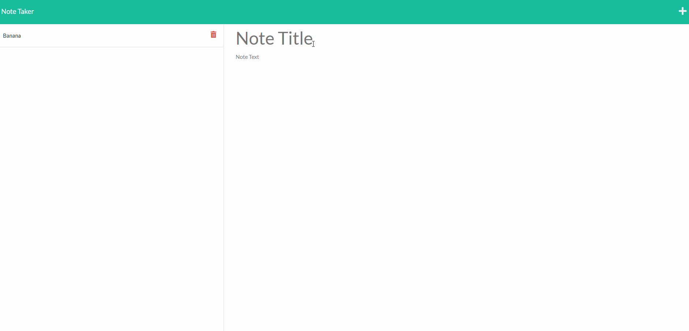

# 6-2-hw-note-taker
[](https://opensource.org/licenses/MIT)
## Description
Node.js based application which lets you save and delete notes using a back-end server. 
## Modules Used
* [uniqid](https://www.npmjs.com/package/uniqid)
* [express](https://www.npmjs.com/package/express)
## Installation
```
npm install express
npm install uniqid
```
## Demo

## Live Link
https://note-taker-hw-6-2.herokuapp.com/notes
## Notes
Front-end functionality and page were supplied as part of assignment. 